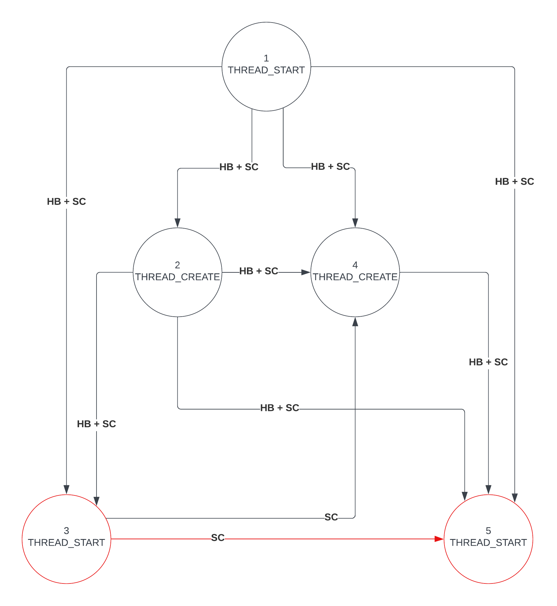

C11Tester: A Testing tool for C11 and C++11 Atomics
=====================================================

C11Tester is a testing tool for C11/C++11 which randomly explores the
behaviors of code under the C/C++ memory model.

C11Tester is constructed as a dynamically-linked shared library which
implements the C and C++ atomic types and portions of the other thread-support
libraries of C/C++ (e.g., std::atomic, std::mutex, etc.).

C11Tester compiles on Linux.  Instrumenting programs requires using
our LLVM pass.  It likely can be ported to other \*NIX flavors.

Mailing List
------------

If you have questions, you can contact us at c11tester@googlegroups.com.

You can sign up for the C11Tester mailing list at:
<https://groups.google.com/forum/#!forum/c11tester>


Added Functionality for Seminar Programming Languages CS4130 course, Matteo Meluzzi
----------------------------------------------------------------------------------- 

#### Goals of this project:
* Compute minimum distance between two racy accesses in (hb + rf + sc) graph
* Find all paths between two racy accesses with distance shorter than k in (hb + rf + sc) graph 

#### Description of implementation:

For every execution, C11Tester constructs a (hb + rf + sc) [graph dynamically as the execution unrolls](execution.cc#L834). 
* a *hb* edge is [added](execution.cc#L891) when an action *happens-before* the current action. This is checked using C11Tester's [clock vectors](clockvector.h).
* an *rf* edge is [added](execution.cc#L855) for all actions that the current one *reads-from*.
* a *sc* edge is [added](execution.cc#L894) when the current action has memory order *memory_order_sequential_consistency* with any past action that has also this memory order.

The (hb + rf + sc) graph implementation can be found in the [relationsgraph.cc](relationsgraph.cc) file.
When a [racy access is detected](datarace.cc#L213) the [minDistanceBetween](relationsgraph.cc#L13) and [allPathsShorterThan](relationsgraph.cc#L83) functions are called on the graph, and the results are printed to the stdout.

* [minDistanceBetween](relationsgraph.cc#L13) uses [Dijkstra](https://en.wikipedia.org/wiki/Dijkstra%27s_algorithm)'s algorithm with a *Priority Queue* datastructure.

* [allPathsShorterThan](relationsgraph.cc#L83) performs [Depth-First-Search](https://en.wikipedia.org/wiki/Depth-first_search) using recursion while keeping in memory the past visited nodes that will form the output path.

#### Example output
Program checked by C11Tester:
```
int x = 0;
int y = 0;

static void a(void *obj) {
	x = 12;
	printf("a exiting, x=%d\n", x);
}

static void b(void *obj) {
	y = x;
	printf("b exiting, x=%d\n", x);
}

int main(int argc, char **argv)
{
	thrd_t t1, t2;
	thrd_create(&t1, (thrd_start_t)&a, NULL);
	thrd_create(&t2, (thrd_start_t)&b, NULL);
	thrd_join(t1);
	thrd_join(t2);
	return 0;
}
```
C11Tester output:
```
Data race detected @ address 0000000000601060:
    Access 1: write in thread  2 @ clock   3
    Access 2:  read in thread  3 @ clock   5
minimum distance between 3 (THREAD_START) and 5 (THREAD_START): 1

all paths with distance less than 10:
PATH 1: 3 (SEQUENTIAL_CONSISTENCY ->) 4 (HAPPENS_BEFORE ->) 5 
PATH 2: 3 (SEQUENTIAL_CONSISTENCY ->) 4 (SEQUENTIAL_CONSISTENCY ->) 5 
PATH 3: 3 (SEQUENTIAL_CONSISTENCY ->) 5 

RELATIONS GRAPH of size 4:
node with seq num 4 (THREAD_CREATE):
         HAPPENS_BEFORE -> 5 (THREAD_START)
         SEQUENTIAL_CONSISTENCY -> 5 (THREAD_START)

node with seq num 3 (THREAD_START):
         SEQUENTIAL_CONSISTENCY -> 4 (THREAD_CREATE)
         SEQUENTIAL_CONSISTENCY -> 5 (THREAD_START)

node with seq num 1 (THREAD_START):
         HAPPENS_BEFORE -> 2 (THREAD_CREATE)
         SEQUENTIAL_CONSISTENCY -> 2 (THREAD_CREATE)
         HAPPENS_BEFORE -> 3 (THREAD_START)
         SEQUENTIAL_CONSISTENCY -> 3 (THREAD_START)
         HAPPENS_BEFORE -> 4 (THREAD_CREATE)
         SEQUENTIAL_CONSISTENCY -> 4 (THREAD_CREATE)
         HAPPENS_BEFORE -> 5 (THREAD_START)
         SEQUENTIAL_CONSISTENCY -> 5 (THREAD_START)

node with seq num 2 (THREAD_CREATE):
         HAPPENS_BEFORE -> 3 (THREAD_START)
         SEQUENTIAL_CONSISTENCY -> 3 (THREAD_START)
         HAPPENS_BEFORE -> 4 (THREAD_CREATE)
         SEQUENTIAL_CONSISTENCY -> 4 (THREAD_CREATE)
         HAPPENS_BEFORE -> 5 (THREAD_START)
         SEQUENTIAL_CONSISTENCY -> 5 (THREAD_START)

Program output from execution 1:
---- BEGIN PROGRAM OUTPUT ----
a exiting, x=12
b exiting, x=12
---- END PROGRAM OUTPUT   ----
```
(hb + rf + sc) graph:


Getting Started
---------------

If you haven't done so already, you may download C11Tester using git:

      git clone git://plrg.eecs.uci.edu/c11tester.git

Get the benchmarks (not required; distributed separately):

      git clone git://plrg.eecs.uci.edu/c11concurrency-benchmarks.git

Get the LLVM frontend using git and follow its directions to build:

      git clone git://plrg.eecs.uci.edu/c11llvm.git

Compile the fuzzer:

      make

To see the help message on how to run C11Tester, execute:

      ./run.sh -h


Useful Options
--------------

`-v`

  > Verbose: show all executions and not just buggy ones.

`-x num`

  > Specify the number number of executions to run.

Benchmarks
-------------------

Many simple tests are located in the `test/` directory.  These are
manually instrumented and can just be run.

You may also want to try the larger benchmarks (distributed
separately).  These require LLVM to instrument.


Running your own code
---------------------

You likely want to test your own code, not just our tests. You will
likely need to use our LLVM pass to instrument your program.  You will
have to modify your build environment to do this.

Test programs should be compiled against our shared library
(libmodel.so).  Then the shared library must be made available to the
dynamic linker, using the `LD_LIBRARY_PATH` environment variable, for
instance.


Reading an execution trace
--------------------------

When C11Tester detects a bug in your program (or when run with the `--verbose`
flag), it prints the output of the program run (STDOUT) along with some summary
trace information for the execution in question. The trace is given as a
sequence of lines, where each line represents an operation in the execution
trace. These lines are ordered by the order in which they were run by C11Tester
(i.e., the "execution order"), which does not necessarily align with the "order"
of the values observed (i.e., the modification order or the reads-from
relation).

The following list describes each of the columns in the execution trace output:

 * \#: The sequence number within the execution. That is, sequence number "9"
   means the operation was the 9th operation executed by C11Tester. Note that
   this represents the execution order, not necessarily any other order (e.g.,
   modification order or reads-from).

 * t: The thread number

 * Action type: The type of operation performed

 * MO: The memory-order for this operation (i.e., `memory_order_XXX`, where `XXX` is
   `relaxed`, `release`, `acquire`, `rel_acq`, or `seq_cst`)

 * Location: The memory location on which this operation is operating. This is
   well-defined for atomic write/read/RMW, but other operations are subject to
   C11Tester implementation details.

 * Value: For reads/writes/RMW, the value returned by the operation. Note that
   for RMW, this is the value that is *read*, not the value that was *written*.
   For other operations, 'value' may have some C11Tester-internal meaning, or
   it may simply be a don't-care (such as `0xdeadbeef`).

 * Rf: For reads, the sequence number of the operation from which it reads.
   [Note: If the execution is a partial, infeasible trace (labeled INFEASIBLE),
   as printed during `--verbose` execution, reads may not be resolved and so may
   have Rf=? or Rf=Px, where x is a promised future value.]

 * CV: The clock vector, encapsulating the happens-before relation (see our
   paper, or the C/C++ memory model itself). We use a Lamport-style clock vector
   similar to [1]. The "clock" is just the sequence number (#). The clock vector
   can be read as follows:

   Each entry is indexed as CV[i], where

            i = 0, 1, 2, ..., <number of threads>

   So for any thread i, we say CV[i] is the sequence number of the most recent
   operation in thread i such that operation i happens-before this operation.
   Notably, thread 0 is reserved as a dummy thread for certain C11Tester
   operations.

See the following example trace:

    ------------------------------------------------------------------------------------
    #    t    Action type     MO       Location         Value               Rf  CV
    ------------------------------------------------------------------------------------
    1    1    thread start    seq_cst  0x7f68ff11e7c0   0xdeadbeef              ( 0,  1)
    2    1    init atomic     relaxed        0x601068   0                       ( 0,  2)
    3    1    init atomic     relaxed        0x60106c   0                       ( 0,  3)
    4    1    thread create   seq_cst  0x7f68fe51c710   0x7f68fe51c6e0          ( 0,  4)
    5    2    thread start    seq_cst  0x7f68ff11ebc0   0xdeadbeef              ( 0,  4,  5)
    6    2    atomic read     relaxed        0x60106c   0                   3   ( 0,  4,  6)
    7    1    thread create   seq_cst  0x7f68fe51c720   0x7f68fe51c6e0          ( 0,  7)
    8    3    thread start    seq_cst  0x7f68ff11efc0   0xdeadbeef              ( 0,  7,  0,  8)
    9    2    atomic write    relaxed        0x601068   0                       ( 0,  4,  9)
    10   3    atomic read     relaxed        0x601068   0                   2   ( 0,  7,  0, 10)
    11   2    thread finish   seq_cst  0x7f68ff11ebc0   0xdeadbeef              ( 0,  4, 11)
    12   3    atomic write    relaxed        0x60106c   0x2a                    ( 0,  7,  0, 12)
    13   1    thread join     seq_cst  0x7f68ff11ebc0   0x2                     ( 0, 13, 11)
    14   3    thread finish   seq_cst  0x7f68ff11efc0   0xdeadbeef              ( 0,  7,  0, 14)
    15   1    thread join     seq_cst  0x7f68ff11efc0   0x3                     ( 0, 15, 11, 14)
    16   1    thread finish   seq_cst  0x7f68ff11e7c0   0xdeadbeef              ( 0, 16, 11, 14)
    HASH 4073708854
    ------------------------------------------------------------------------------------

Now consider, for example, operation 10:

This is the 10th operation in the execution order. It is an atomic read-relaxed
operation performed by thread 3 at memory address `0x601068`. It reads the value
"0", which was written by the 2nd operation in the execution order. Its clock
vector consists of the following values:

        CV[0] = 0, CV[1] = 7, CV[2] = 0, CV[3] = 10

End of Execution Summary
------------------------

C11Tester prints summary statistics at the end of each execution. These
summaries are based off of a few different properties of an execution, which we
will break down here:

* A _buggy_ execution is an execution in which C11Tester has found a real
  bug: a data race, a deadlock, or a failure of a user-provided assertion.
  C11Tester will only report bugs in feasible executions.


Other Notes and Pitfalls
------------------------

* Data races may be reported as multiple bugs, one for each byte-address of the
  data race in question. See, for example, this run:

        $ ./run.sh test/releaseseq.o
        ...
        Bug report: 4 bugs detected
          [BUG] Data race detected @ address 0x601078:
            Access 1: write in thread  2 @ clock   4
            Access 2:  read in thread  3 @ clock   9
          [BUG] Data race detected @ address 0x601079:
            Access 1: write in thread  2 @ clock   4
            Access 2:  read in thread  3 @ clock   9
          [BUG] Data race detected @ address 0x60107a:
            Access 1: write in thread  2 @ clock   4
            Access 2:  read in thread  3 @ clock   9
          [BUG] Data race detected @ address 0x60107b:
            Access 1: write in thread  2 @ clock   4
            Access 2:  read in thread  3 @ clock   9


See Also
--------

The C11Tester project page:

>   <http://demsky.eecs.uci.edu/c11tester.html>

The C11Tester source and accompanying benchmarks on Gitweb:

>   <http://plrg.eecs.uci.edu/git/?p=c11tester.git>
>
>   <http://plrg.eecs.uci.edu/git/?p=c11llvm.git>
>
>   <http://plrg.eecs.uci.edu/git/?p=c11concurrency-benchmarks.git>


Contact
-------

Please feel free to contact us for more information. Bug reports are welcome,
and we are happy to hear from our users. We are also very interested to know if
C11Tester catches bugs in your programs.

Contact Weiyu Luo at <weiyul7@uci.edu> or Brian Demsky at <bdemsky@uci.edu>.


Copyright
---------

Copyright &copy; 2013 and 2019 Regents of the University of California. All rights reserved.

C11Tester is distributed under the GPL v2. See the LICENSE file for details.


Acknowledgments
---------------

This material is based upon work supported by the National Science
Foundation under Grant Numbers 1740210 and 1319786 and Google Research 
awards.

Any opinions, findings, and conclusions or recommendations expressed in
this material are those of the author(s) and do not necessarily reflect
the views of the National Science Foundation.


References
----------

[1] L. Lamport. Time, clocks, and the ordering of events in a distributed
    system. CACM, 21(7):558-565, July 1978.
